# TextRecognitionDataGenerator [](https://travis-ci.org/Belval/TextRecognitionDataGenerator) [](https://badge.fury.io/py/trdg) [](https://codecov.io/gh/Belval/TextRecognitionDataGenerator) [](https://textrecognitiondatagenerator.readthedocs.io/en/latest/?badge=latest) [](https://mattermost.belval.org/signup_user_complete/?id=6j1pj6itd7y4781o1u813796ry)

A synthetic data generator for text recognition

## What is it for?

Generating text image samples to train an OCR software. Now supporting non-latin text! For a more thorough tutorial see [the official documentation](https://textrecognitiondatagenerator.readthedocs.io/en/latest/index.html).

## What do I need to make it work?

Install the pypi package

```
pip install trdg
```

Afterwards, you can use `trdg` from the CLI. I recommend using a virtualenv instead of installing with `sudo`.

If you want to add another language, you can clone the repository instead. Simply run `pip install -r requirements.txt`

## Docker image

If you would rather not have to install anything to use TextRecognitionDataGenerator, you can pull the docker image.

```
docker pull belval/trdg:latest

docker run -v /output/path/:/app/out/ -t belval/trdg:latest trdg [args]
```

The path (`/output/path/`) must be absolute.

## New
- Add python module
- Move `run.py` to an executable python file ([`trdg/bin/trdg`](trdg/bin/trdg))
- Add `--font` to use only one font for all the generated images (Thank you @JulienCoutault!)
- Add `--fit` and `--margins` for finer layout control
- Change the text orientation using the `-or` parameter
- Specify text color range using `-tc '#000000,#FFFFFF'`, please note that the quotes are **necessary**
- Add support for Simplified and Traditional Chinese

## How does it work?

Words will be randomly chosen from a dictionary of a specific language. Then an image of those words will be generated by using font, background, and modifications (skewing, blurring, etc.) as specified.

### Basic (Python module)

The usage as a Python module is very similar to the CLI, but it is more flexible if you want to include it directly in your training pipeline, and will consume less space and memory. There are 4 generators that can be used.

```py
from trdg.generators import (
    GeneratorFromDict,
    GeneratorFromRandom,
    GeneratorFromStrings,
    GeneratorFromWikipedia,
)

# The generators use the same arguments as the CLI, only as parameters
generator = GeneratorFromStrings(
    ['Test1', 'Test2', 'Test3'],
    blur=2,
    random_blur=True
)

for img, lbl in generator:
    # Do something with the pillow images here.
```

You can see the full class definition here:

- [`GeneratorFromDict`](trdg/generators/from_dict.py)
- [`GeneratorFromRandom`](trdg/generators/from_random.py)
- [`GeneratorFromStrings`](trdg/generators/from_strings.py)
- [`GeneratorFromWikipedia`](trdg/generators/from_wikipedia.py)

### Basic (CLI)

`trdg -c 1000 -w 5 -f 64`

You get 1,000 randomly generated images with random text on them like:

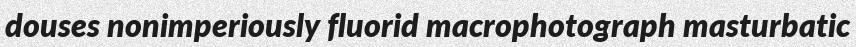
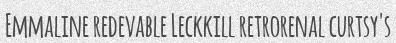
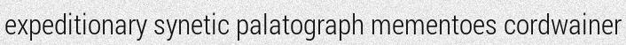
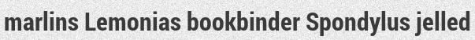
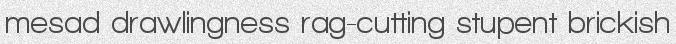

By default, they will be generated to `out/` in the current working directory.

### Text skewing

What if you want random skewing? Add `-k` and `-rk` (`trdg -c 1000 -w 5 -f 64 -k 5 -rk`)

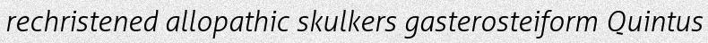
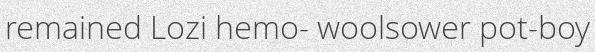

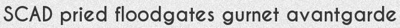


### Text distortion
You can also add distorsion to the generated text with `-d` and `-do`

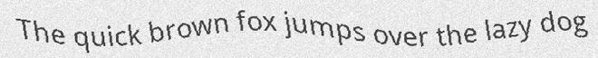
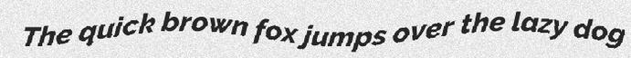


### Text blurring

But scanned document usually aren't that clear are they? Add `-bl` and `-rbl` to get gaussian blur on the generated image with user-defined radius (here 0, 1, 2, 4):


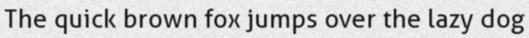

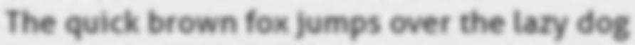

### Background

Maybe you want another background? Add `-b` to define one of the three available backgrounds: gaussian noise (0), plain white (1), quasicrystal (2) or picture (3).

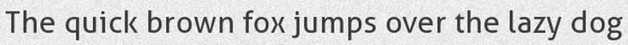


When using picture background (3). A picture from the pictures/ folder will be randomly selected and the text will be written on it.

### Handwritten

Or maybe you are working on an OCR for handwritten text? Add `-hw`! (Experimental)

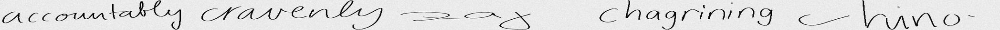
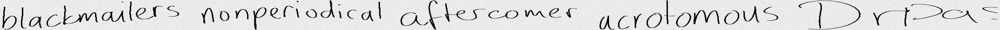

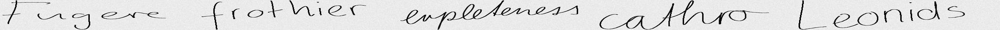
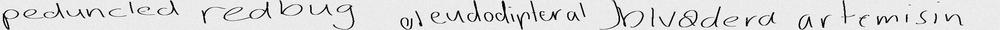

It uses a Tensorflow model trained using [this excellent project](https://github.com/Grzego/handwriting-generation) by Grzego.

**The project does not require TensorFlow to run if you aren't using this feature**

### Dictionary

The text is chosen at random in a dictionary file (that can be found in the *dicts* folder) and drawn on a white background made with Gaussian noise. The resulting image is saved as [text]\_[index].jpg

There are a lot of parameters that you can tune to get the results you want, therefore I recommend checking out `trdg -h` for more information.

## Create images with Chinese text

It is simple! Just do `trdg -l cn -c 1000 -w 5`!

Generated texts come both in simplified and traditional Chinese scripts.

Traditional:

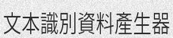

Simplified:

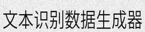

## Add new fonts

The script picks a font at random from the *fonts* directory.

| Directory | Languages |
|:----|:-----|
| fonts/latin | English, French, Spanish, German |
| fonts/cn | Chinese |

Simply add/remove fonts until you get the desired output.

If you want to add a new non-latin language, the amount of work is minimal.

1. Create a new folder with your language [two-letters code](https://en.wikipedia.org/wiki/List_of_ISO_639-1_codes)
2. Add a .ttf font in it
3. Edit `bin/trdg` to add an if statement in `load_fonts()`
4. Add a text file in `dicts` with the same two-letters code
5. Run the tool as you normally would but add `-l` with your two-letters code

It only supports .ttf for now.

## Benchmarks

Number of images generated per second.

- Intel Core i7-4710HQ @ 2.50Ghz + SSD (-c 1000 -w 1)
    - `-t 1` : 363 img/s
    - `-t 2` : 694 img/s
    - `-t 4` : 1300 img/s
    - `-t 8` : 1500 img/s
- AMD Ryzen 7 1700 @ 4.0Ghz + SSD (-c 1000 -w 1)
    - `-t 1` : 558 img/s
    - `-t 2` : 1045 img/s
    - `-t 4` : 2107 img/s
    - `-t 8` : 3297 img/s

## Contributing

1. Create an issue describing the feature you'll be working on
2. Code said feature
3. Create a pull request

## Feature request & issues

If anything is missing, unclear, or simply not working, open an issue on the repository.

## What is left to do?
- Better background generation
- Better handwritten text generation
- More customization parameters (mostly regarding background)
